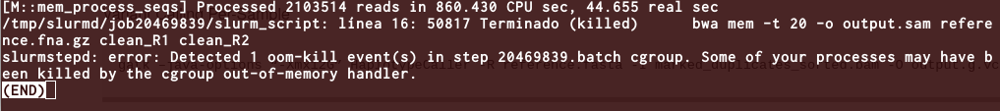

# Práctico SNPs

## Introducción
Una de las mayores dificultades que tenemos al momento de querer obtener resultados 
de un análisis bioinformático consiste en la instalación de los programas, en este práctico, 
parte importante consistirá en que ustedes logren instalar y generar el ambiente necesario para 
tener un pipeline funcional total de análisis de variantes (SECCIÓN PRELIMINARES) y luego 
ejecutar un análisis sobre reads públicos del proyecto internacional [1000 genomas](www.1000genomes.org).


En el siguiente práctico ejecutaremos el pipeline de [GATK](https://gatk.broadinstitute.org/hc/en-us).
Luego anotaremos las variantes y buscaremos el resultado en bases de datos internacionales.

## Objetivos

1. Demostrar la capacidad de instalar un programa en HPC desde su carpeta local sin permiso de root.
2. Poder ejecutar el pipeline y la generación de scripts `SBATCH` por si solos.
3. Montar la capacidad de buscar variantes en HPC.
4. Buscar Variantes utilizando GATK ([artículo](https://genome.cshlp.org/content/20/9/1297.short)).
5. Anotar las variantes con [ANNOVAR](http://wannovar.wglab.org/) ([artículo](https://www.nature.com/articles/nprot.2015.105)).
6. Interpretar los resultados.


## Preliminares

El ejercicio comienza desde cero, es decir, generaremos un ambiente en el [NLHPC](www.nlhpc.cl) por nuestra cuenta para ejecutar GATK.
Para esto, deberemos preparar todo el ambiente. 

Conéctese al NLHPC utilizando su usuario y contraseña y en su `HOME`... 

Comenzaremos creando una carpeta inicial:

    mkdir GATK

Entre a su carpeta, si no tiene instalada una versión de miniconda, descargue e instale miniconda:

Para esto descargaremos miniconda, iremos a [conda](https://docs.conda.io/en/latest/miniconda.html) y descargaremos la última versión en este caso Latest - Conda 24.9.2 Python 3.12.7 released Oct 23, 2024:

    wget https://repo.anaconda.com/miniconda/Miniconda3-latest-Linux-x86_64.sh


Crearemos un job para instalar anaconda:

    vim install.sbatch
      
 escribimos lo siguiente (deberá reemplazar su usuario y mail en el campo mail, para revisar que le llega la secuencia):
 ```bash
 #!/bin/sh

 #SBATCH --job-name=miniconda
 #SBATCH --output=mini.out
 #SBATCH --error=mini.err
 #SBATCH --mail-user=user@mail.com
 #SBATCH --nodes=1
 #SBATCH --mail-type=ALL
 sh Miniconda3-latest-Linux-x86_64.sh -b -p $HOME/anaconda3
```

Guardamos y ejecutamos nuestro job:

    sbatch install.sbatch
      
y esperamos la instalación, luego de que se haya completado la instalación (aprox 10 min).

Podemos monitorear el estado de nuestro job con el comando watch y squeue:

    watch squeue

Si lo ejecutó por defecto, su instalación debería quedar en el path: `/home/courses/student[07-10]/anaconda3`.

Cuando la instalación se haya completado, inicializaremos conda para que considere 
nuestro "brand new" python como el python por defecto:

    conda init

Para activar el ambiente ejecutaremos

    cd 
    cd anaconda3/condabin/
    ./conda init
    
Nos saldremos de NLHPC y volveremos a hacer login

    exit
    ssh student[07-10]@server

Ahora deberiamos ver en nuestro prompt algo como esto:

    (base)user@server:~$
      
Ya tenemos nuestro python local corriendo y listo para instalarle paquetes.

Crearemos un ambiente 
 
    conda create --name gatk python=3.11

Con esto hemos creado un nuevo ambiente python 3.11, puede revisar sus ambientes en `~/anaconda3/envs/` o con ```conda env list```.

    conda activate gatk
      
el prompt debería cambiar a:
      
    (gatk)user@server:~$

podemos ver que nuestro python ahora cambio de dirección de nuevo:

    which python
    
Todavía nos queda instalar algunas herramientas bioinformáticas que utilizaremos en el práctico.

    mkdir bin
    cd bin

Instalaremos [BBMap](https://jgi.doe.gov/data-and-tools/bbtools/bb-tools-user-guide/bbmap-guide/)

    wget https://sourceforge.net/projects/bbmap/files/latest/download

Podemos ver que al descargar nos quedará un archivo `download`.

si ejecutamos un file:
    
    file download
    
veremos que es `download: gzip compressed data, was "BBMap_39.11.tar"`, es decir un archivo `.tar.gz`

    tar xvfz download
    rm download
    cd bbmap

revisaremos si funciona bbduk:
    
    ./bbduk.sh
Perfecto,

Ahora instalaremos [BWA](https://github.com/lh3/bwa)

    git clone https://github.com/lh3/bwa.git
    cd bwa
    make -j 8

revisaremos si funcional BWA
    ./bwa
 
Perfecto,

Todavía nos falta samtools, para esto utilizaremos un recipe de 
conda, porque sino sería muy compleja la instalación:

    conda install -c bioconda samtools

Revisamos que funcione:

	samtools

ERROR:


Podemos ver que nuestro entorno tiene un problema, si exploramos algunos foros para saber si es que alguien ya ha pasado por este problema, pasamos algunas horas leyendo y revisando los threads de respuesta en algunos foros
como este de una [tool para Pacbio](https://github.com/PacificBiosciences/pbbioconda/issues/85), sin embargo, en [biostars](https://www.biostars.org/) un foro de bioinformática (muy bueno por cierto), hay una aproximación más confiable, podríamos probar esta solución:

	conda install "samtools>=1.10"

Podemos ver que este comando no soluciona el problema y es porque necesitamos ir a los repositorios de bioconda:

	conda install -c bioconda "samtools>=1.10"

Ahora probaremos samtools

	samtools

Perfecto,

Ahora instalaremos [Picard tools](https://broadinstitute.github.io/picard/):

	conda install bioconda/label/cf201901::picard

probamos picard:

	picard


Ahora volvemos a nuestro `$HOME` y crearemos la carpeta `READS`:

    cd
    mkdir reads

Dentro de la carpeta reads descargaremos los siguientes archivos del proyecto 1000 genomas:

    wget ftp://ftp.1000genomes.ebi.ac.uk/vol1/ftp/phase3/data/HG00096/sequence_read/SRR062634_1.filt.fastq.gz
    wget ftp://ftp.1000genomes.ebi.ac.uk/vol1/ftp/phase3/data/HG00096/sequence_read/SRR062634_2.filt.fastq.gz

Luego extraeremos los reads:

     gzip -d SRR062634_1.filt.fastq.gz
     gzip -d SRR062634_2.filt.fastq.gz

Haremos un enlace simbólico a los reads:

    ln -s SRR062634_1.filt.fastq.gz R1.fq
    ln -s SRR062634_2.filt.fastq.gz R2.fq

Haremos un enlace simbólico al archivo de adaptadores para [bbduk](https://github.com/BioInfoTools/BBMap/blob/master/resources/adapters.fa)

    ln -s $HOME/bin/bbmap/resources/adapters.fa .
    
 Descargamos el genoma humano:
 
    wget https://ftp.ncbi.nlm.nih.gov/genomes/all/GCF/000/001/405/GCF_000001405.39_GRCh38.p13/GCF_000001405.39_GRCh38.p13_genomic.fna.gz
 
 Generamos un enlace simbólico a la referencia:
 
    ln -s GCF_000001405.39_GRCh38.p13/GCF_000001405.39_GRCh38.p13_genomic.fna.gz reference.fna.gz

## GATK Pipeline Magic

Basado en las recomendaciones de [Ricardo Palma](http://www.cmm.uchile.cl/?cmm_people=ricardo-palma) 
recopiladas de los foros de GATK y las buenas prácticas.


#### Paso 1. Filtrado:

Para cada comando o conjunto de comandos deberá realizar un script `SBATCH` para ejecutar sus tareas.
Realizaré solo el primer script como instructivo:

Realizaremos el filtrado con [BBDUK](https://jgi.doe.gov/data-and-tools/bbtools/bb-tools-user-guide/bbduk-guide/) “””aka Magical Mathematics of Console Gymnastics ””” 

    bbduk.sh -Xmx3g in=R1.fq in2=R2.fq ref=adaptor_file.fa mm=f \\
    rcomp=f out=clean_R1 out2=clean_R2 threads=20 minlen=read_min_len \\
    qtrim=lr trimq=20 ktrim=r k=21 mink=9 hdist=1 tpe tbo overwrite=true

Parámetros:

read_min_len: Minimal size of read length before trimming. (depends on sample 
profiles)

Script `SBATCH`:

Crearemos un archivo 
    
    vim runbb.sbatch

y escribimos el siguiente contenido:

```sh
#!/bin/sh

#SBATCH --job-name=bbduk ### ASIGNAMOS EL NOMBRE: bbduk
#SBATCH --output=bbduk.out ### asignamos un archivo que nos guarde la salida o el STDOUT del programa
#SBATCH --error=bbduk.err ### asignamos un archivo que nos guarde el error o el STDERR del programa
#SBATCH --mail-user=user@mail.com ### asignamos un mail para que nos envié el status del job
#SBATCH --nodes=1   ### forzamos a que esto se ejecute en un solo nodo
#SBATCH --mail-type=ALL ### queremos que nos lleguen todos los status
#SBATCH --mem=4G ### en el flag -Xmx3g de bbduk estamos asignando 3 gigabytes de ram por lo que asignamos 4G de ram ante un inesperado peak.
#SBATCH --cpus-per-task=20 ### en el flag threads=20 de bbduk estamos asignando 20 cpus por lo que tenemos que configurarlo en el scheduler.
 
### INDICAMOS AL NODO DONDE ESTA BBDUK
export PATH=~/bin/bbmap:$PATH

#### Ejecutamos bbduk

bbduk.sh -Xmx3g in=R1.fq in2=R2.fq ref=adapters.fa mm=f rcomp=f out=clean_R1 out2=clean_R2 threads=20 minlen=50 qtrim=lr trimq=20 ktrim=r k=21 mink=9 hdist=1 tpe tbo overwrite=true

```
## ES MUY IMPORTANTE QUE SIEMPRE REVISEMOS EL ARCHIVO .err, PARA SABER COMO ANDUVO NUESTRO JOB

Si llegara a tener una línea como esta:


Es porque se parametrizó mal la cantidad de memoria que requería su trabajo.


#### Paso 2, Mapping [BWA](http://bio-bwa.sourceforge.net/)

Indexamos el genoma humano:

    bwa index reference.fna.gz

Mapeamos los reads al genoma (ATENTO CON LOS PARÁMETROS DE SU JOB):

    bwa mem -t 20 -o output.sam reference.fna.gz clean_R1 clean_R2

Transformamos nuestro archivo sam a formato bam:

    samtools view -bS output.sam > output.bam


#### Paso 3, [MarkDuplicates](https://gatk.broadinstitute.org/hc/en-us/articles/360037224932-MarkDuplicatesSpark)

Marcamos los duplicados  y ordenamos el BAM

    gatk MarkDuplicatesSpark -I output.bam -O marked_duplicates_sorted.bam

#### Opcional

Si es que no llegara a funcionar podemos utilizar siempre el método antiguo

    java -jar picard.jar MarkDuplicates I= output.bam O=marked_duplicates.bam M=marked_dup_metrics.txt

    samtools sort -T temp_sorted.bam -o marked_duplicates_sorted.bam marked_dup_metrics.txt


#### Paso 4 [Haplotypecalller](https://gatk.broadinstitute.org/hc/en-us/articles/360042913231-HaplotypeCaller): 

Variant Calling Per-Sample


    gatk –java-options “-Xmx12G” HaplotypeCaller -R reference.fasta -I marked_duplicates_sorted.bam -O output.g.vcf.gz -ERC GVCF

#### Paso 5 

VariantRecalibrator, and [ApplyVQSR](https://gatk.broadinstitute.org/hc/en-us/articles/360035531112--How-to-Filter-variants)
-either-with-VQSR-or-by-hard-filtering 

##### First, split the g_vcf. Files into SNPs and INDELs:

    gatk SelectVariants -V output.g.vcf.gz -select-type SNP -O only_snps.vcf.gz
    gatk SelectVariants -V output.g.vcf.gz -select-type INDEL -O only_indels.vcf.gz

Now apply the “Hard-filtering” for Variants.


###### Hard-Filtering for SNPs

    gatk VariantFiltration -V only_snps.vcf.gz -filter "QD < 2.0" --filter-name "QD2" \\
    -filter "QUAL < 30.0" --filter-name "QUAL30" -filter "SOR > 3.0" --filter-name "SOR3" \\
    -filter "FS > 60.0" --filter-name "FS60" -filter "MQ < 40.0" --filter-name "MQ40" \\
    -filter "MQRankSum < -12.5" --filter-name "MQRankSum-12.5" -filter "ReadPosRankSum < -8.0" \\
    --filter-name "ReadPosRankSum-8" -O snps_filtered.vcf.gz


###### Hard-Filtering for INDELs

    gatk VariantFiltration V only_indels.vcf.gz -filter "QD < 2.0" --filter-name "QD2" \\
    -filter "QUAL < 30.0" --filter-name "QUAL30" -filter "FS > 200.0" --filter-name "FS200" \\
    -filter "ReadPosRankSum < -20.0" --filter-name "ReadPosRankSum-20" -O indels_filtered.vcf.gz


    If a variant Pass all filters it will be tag as PASS in the “INFO” field 
    of the VCF, if not the name of the fault filter will be displayed.

#### Last Step

Extraer todas las variantes que pasaron el filtro `PASS` en GATK.


###### _Congrats, you skipped 6 months navigating GATK forums. Ricardo Palma_ 


      


      

       
      


